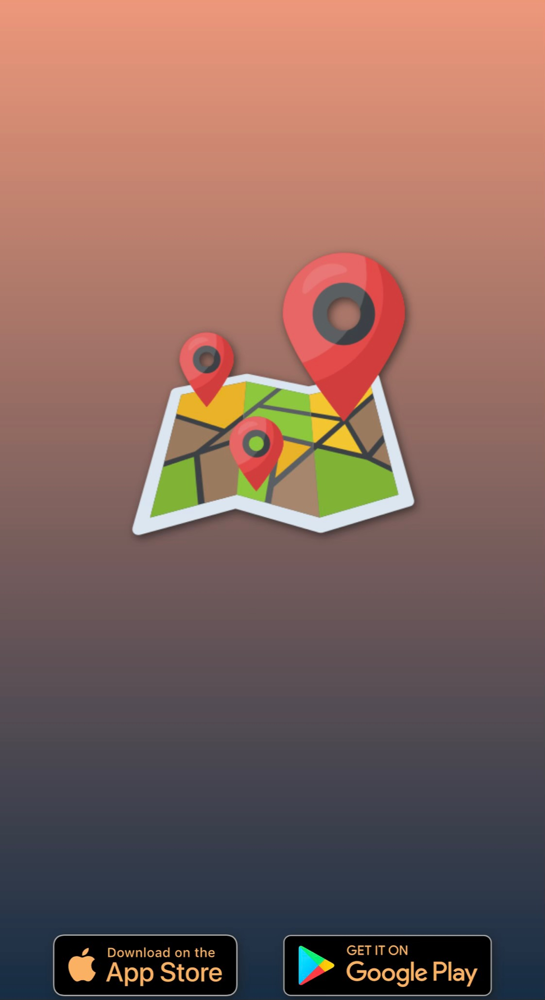
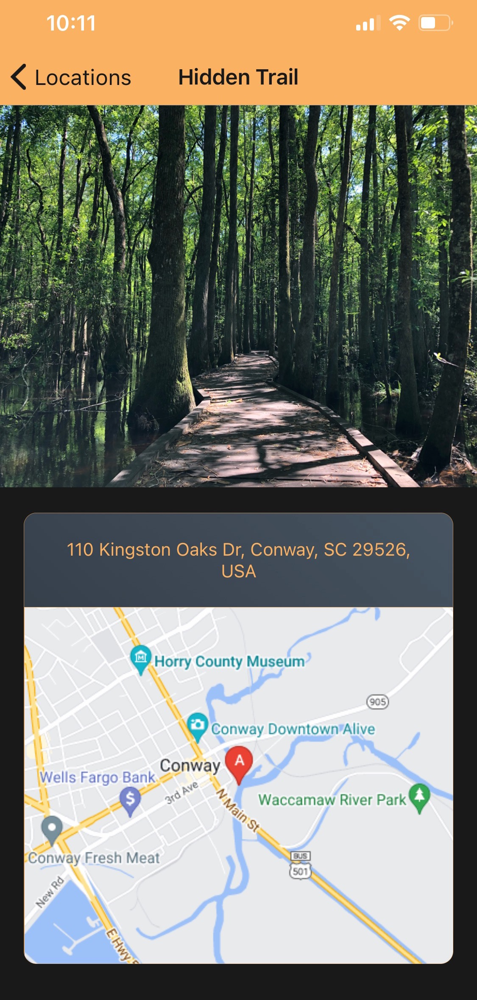

<div align="center">


# Connectify

Cross-platform mobile application for travel and geolocation documentation

</div>


---

## Downloading the App

This app is currently in beta testing for version 0.1.2

### Android / IOS

- Awaiting review from Google Play

---

|                   Splash Screen                   |                      Add Location                      |
| :-----------------------------------------------: | :----------------------------------------------------: |
|  |  |

|                                          |                      Location Detail                      |
| :-----------------------------------------------------: | :-------------------------------------------------------: |
| |  |

---

## About Version 0.1.2

Create and store a list of defined locations to the device with an associated image and description. Click the saved location to reveal the location details screen. Interactive map screen for viewing or selecting location. Swipe saved location to the left to delete location.

Requires permissions for native camera, photo library, and geolocation features.

---

## Project Details

- Developed with [React Native](https://reactnative.dev/) (0.71.3) and the [Expo](https://expo.dev/) SDK (48.0.0)
- [Google Maps Platform](https://developers.google.com/maps) for geolocation
- Allows the user to create and store a list of defined locations with an associated image and description
- Home screen provides a list of user created locations with a clickable details screen
- Interactive map screen for viewing or selecting locations
- Persists data via [SQLite](https://www.sqlite.org/index.html)
- Automated address retrieval via reverse-geolocation
- Utilizes native camera, photo library, and map functionality
- [Redux](https://redux.js.org/) to manage location state
- Button icons by [ionicons](https://ionic.io/ionicons) via [react-native-vector-icons](https://www.npmjs.com/package/react-native-vector-icons)
- Icons made by [Freepik](https://www.freepik.com) from www.flaticon.com

---

## Getting Started

- Create a [.env](https://www.npmjs.com/package/react-native-dotenv) file in the 'src' directory and include the contents of the [.env.example](src/.env.example)

- To install the Expo CLI

  ```bash
  npm install --global expo-cli
  ```

- To install dependencies, navigate to the 'src' directory and execute in the terminal:

  ```bash
  npm install
  ```

- To run the development server:

  ```bash
  npm start
  ```

---

## About React Native

React Native brings [**React**'s][r] declarative UI framework to iOS and Android. With React Native, you use native UI controls and have full access to the native platform.

[r]: https://reactjs.org/
[p]: https://reactnative.dev/docs/out-of-tree-platforms
[e]: https://github.com/facebook/react-native/blob/HEAD/ECOSYSTEM.md

## Contents

- [Requirements](#-requirements)
- [Documentation](#-documentation)
- [License](#-license)

---

## 📋 Requirements

React Native apps may target iOS 11.0 and Android 5.0 (API 21) or newer. You may use Windows, macOS, or Linux as your development operating system, though building and running iOS apps is limited to macOS. Tools like [Expo](https://expo.io) can be used to work around this.

---

## 📖 Documentation

The full documentation for React Native can be found on our [website][docs].

The React Native documentation discusses components, APIs, and topics that are specific to React Native. For further documentation on the React API that is shared between React Native and React DOM, refer to the [React documentation][r-docs].

The source for the React Native documentation and website is hosted on a separate repo, [**@facebook/react-native-website**][repo-website].

[docs]: https://reactnative.dev/docs/getting-started
[r-docs]: https://reactjs.org/docs/getting-started.html
[repo-website]: https://github.com/facebook/react-native-website

### [Open Source Roadmap][roadmap]

You can learn more about our vision for React Native in the [**Roadmap**][roadmap].

[roadmap]: https://github.com/facebook/react-native/wiki/Roadmap

---

## 📄 License

React Native is MIT licensed, as found in the [LICENSE][l] file.

React Native documentation is Creative Commons licensed, as found in the [LICENSE-docs][ld] file.

[l]: https://github.com/facebook/react-native/blob/HEAD/LICENSE
[ld]: https://github.com/facebook/react-native/blob/HEAD/LICENSE-docs
